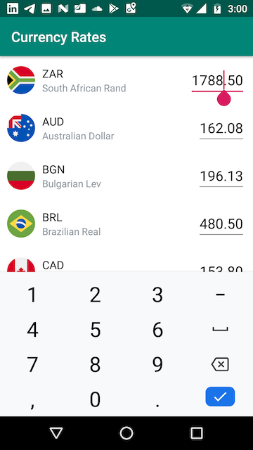

# Currency Rates

Application for showing list of currency rates received from the endpoint (one per row). 
Each row has an input where you can enter any amount of money. 
When you tap on currency row it slides to the top and its input becomes the first responder. 
When you’re changing the amount of money the app simultaneously updates the corresponding value for other currencies.

## Architecture

The app is written in [Kotlin](https://kotlinlang.org/) and based on [Android Architecture Components](https://developer.android.com/topic/libraries/architecture) 
which are the part of [Android Jetpack](https://developer.android.com/jetpack)

[ViewModel](https://developer.android.com/topic/libraries/architecture/viewmodel) is used for implementing [MVVM](https://en.wikipedia.org/wiki/Model–view–viewmodel)
architectural pattern

[Data Binding](https://developer.android.com/topic/libraries/data-binding/) is used for binding UI widgets in layouts to
data sources

[Live Data](https://developer.android.com/topic/libraries/architecture/livedata) is used for observing of object changes by UI components

[Dagger 2](https://dagger.dev/android.html) is used for implementing [dependency injection](https://en.wikipedia.org/wiki/Dependency_injection)

[Retrofit](https://square.github.io/retrofit/) is used for netwoking with backend through REST API

[Kotlin Coroutines](https://kotlinlang.org/docs/reference/coroutines-overview.html) are used for handling asynchronous or non-blocking tasks

[Room Persistence Library](https://developer.android.com/topic/libraries/architecture/room) is used as a local database layer to support offline mode

## Testing

The project includes both instrumentation tests that run on the device and local unit tests that run on your computer

### Unit Tests

Repository Test uses fake implementations of remote and local Data Sources

ViewModel Test uses fake implementation of Repository with necessary Test Rules

WebService Test uses [MockWebServer](https://github.com/square/okhttp/tree/master/mockwebserver) for testing REST API interactions

### Device Tests

Fragment Test uses [FragmentScenario](https://developer.android.com/reference/androidx/fragment/app/testing/FragmentScenario) to create fragments and [RecyclerViewActions](https://developer.android.com/reference/androidx/test/espresso/contrib/RecyclerViewActions) to interact with list items

Room Dao Test uses [inMemoryDatabase](https://developer.android.com/reference/android/arch/persistence/room/Room#inmemorydatabasebuilder) where stored information disappears when the process is killed

## Screenshots

&nbsp;&nbsp;&nbsp;&nbsp;

## License

    Copyright 2019 Oleh Kapustianov

    Licensed under the Apache License, Version 2.0 (the "License");
    you may not use this file except in compliance with the License.
    You may obtain a copy of the License at

        http://www.apache.org/licenses/LICENSE-2.0

    Unless required by applicable law or agreed to in writing, software
    distributed under the License is distributed on an "AS IS" BASIS,
    WITHOUT WARRANTIES OR CONDITIONS OF ANY KIND, either express or implied.
    See the License for the specific language governing permissions and
    limitations under the License.
